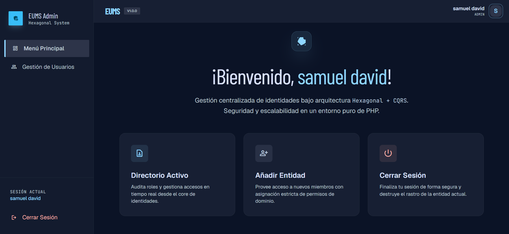
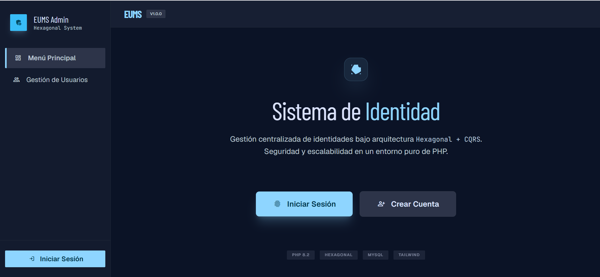
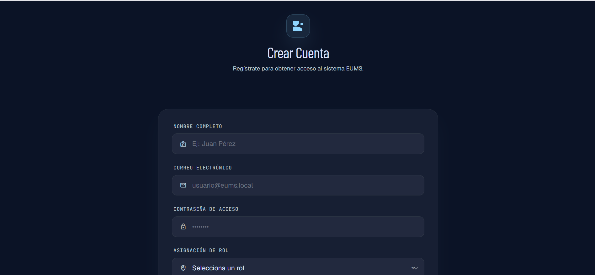
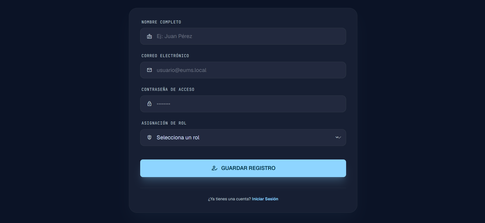

# EUMS - Enterprise User Management System 🚀


EUMS es una plataforma avanzada de gestión de identidades diseñada bajo los principios de **Clean Architecture**, utilizando un enfoque **Hexagonal con CQRS y DDD**. El sistema ha sido modernizado con una interfaz **"Cyber-Dark Dashboard"** de alto impacto visual.

## 📸 Visual Showcase

### 🖥️ Dashboard Principal


### 🔐 Acceso de Seguridad
<p align="center">
  
  
</p>

### 🎥 Demostración en Video
[](https://youtu.be/UGU6ZAgrlLg)

*Haz clic en el botón de arriba para ver la demostración completa en YouTube.*

## 📸 Galería del Sistema

### 🏠 Inicio y Bienvenida
<p align="center">
  
  
</p>

### 🔐 Autenticación y Registro
<p align="center">
  
  
  
</p>
<p align="center">
  
  
</p>

### 👥 Administración de Usuarios
<p align="center">
  
</p>
<p align="center">
  
  
</p>
<p align="center">
  
</p>

## 🛠️ Stack Tecnológico

- **Backend:** PHP 8.2 (Pure Hexagonal Architecture)
- **Frontend:** Tailwind CSS (Modern Admin UI)
- **Base de Datos:** MySQL (PDO)
- **Patrones:** CQRS (Command Query Responsibility Segregation), DDD (Domain-Driven Design), Dependency Injection.

## ✨ Características Principales

- **Dashboard Moderno:** Interfaz responsiva con estética "Cyber-Dark" y soporte para roles.
- **Gestión de Usuarios (CRUD):** Registro, edición, visualización y eliminación de entidades con validación estricta de dominio.
- **Seguridad Robusta:** Autenticación local segura y manejo de sesiones optimizado.
- **Arquitectura desacoplada:** Separación total entre la infraestructura, la aplicación y el dominio.

## 🏗️ Arquitectura del Proyecto

El proyecto sigue una estructura de capas estricta:
- **Domain:** Lógica de negocio pura (Entidades, Repositorios e Interfaces).
- **Application:** Casos de uso y orquestación de comandos/consultas.
- **Infrastructure:** Implementaciones técnicas (Base de datos, Entrypoints Web, Presentación).

## 🚀 Instalación y Uso

1. **Clonar el repositorio:**
   ```bash
   git clone https://github.com/SamuelOsp/php-hexagonal-ddd-cqrs.git
   ```
2. **Configurar la Base de Datos:**
   Importa el archivo SQL incluido en el proyecto a tu servidor MySQL (XAMPP/Laragon).
3. **Configurar Conexión:**
   Asegúrate de que `Common/DependencyInjection.php` tenga las credenciales correctas de tu DB.
4. **Ejecutar:**
   Inicia el servidor local y accede a `localhost`.

## 👤 Autor

Desarrollado por **Samuel Ospina** ([@SamuelOsp](https://github.com/SamuelOsp))
*Estudiante de Ingeniería de Software - Semestre 7*

---
*Este proyecto fue refactorizado para cumplir con los más altos estándares de calidad de software y diseño moderno.*
